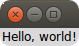
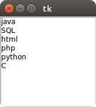

# Tkinter窗口界面设计

## 最基本的调用方法
```python
#!/usr/bin/python
# -*- coding: UTF-8 -*-

import Tkinter

tk = Tkinter.Tk()
tk.mainloop()
```

## Tkinter控件

#### Button(按钮)
Button(frame, text="QUIT", fg="red", command=frame.quit)

destroy只有你在特殊的环境下运行这个例子才需要;
当时间循环被终止的时候，它会明确的释放这个窗口。
一些开发环境只有调用这个方法才会终止Python进程。

#### Entry(输入框)
#### Label(标签)

```python
#!/usr/bin/python
# -*- coding: UTF-8 -*-

from Tkinter import *

root = Tk()

label = Label(root, text="Hello, world!")
label.pack()  # 根据内容自动调整大小

root.mainloop()
```
#### Checkbutton(多选按钮)
#### Radiobutton(单选按钮)

#### Listbox(列表框)

```python
#!/usr/bin/python
# -*- coding: UTF-8 -*-

from Tkinter import *

tk = Tk()

languages = ['C', 'python', 'php', 'html', 'SQL', 'java']
listbox = Listbox(tk)
for item in languages:
    listbox.insert(0, item)
    # listbox.insert(END, item)
listbox.pack()

tk.mainloop()
```


#### Scrollbar(滚动条)
#### Scale(范围控件)
#### Text(文本)
#### Frame(框架)


#### Canvas(画布)	画布控件；显示图形元素如线条或文本
#### Menubutton(菜单按钮)	菜单按钮控件，由于显示菜单项。
#### Menu(菜单)	菜单控件；显示菜单栏,下拉菜单和弹出菜单
#### Message(消息控件)	消息控件；用来显示多行文本，与label比较类似
#### Toplevel(容器控件)	容器控件；用来提供一个单独的对话框，和Frame比较类似
#### Spinbox(输入控件)	与Entry类似，但是可以指定输入范围值
#### PanedWindow(布局控件)	PanedWindow是一个窗口布局管理的插件，可以包含一个或者多个子控件。
#### LabelFrame(容器控件)	labelframe 是一个简单的容器控件。常用与复杂的窗口布局。
#### tkMessageBox(消息框)	用于显示你应用程序的消息框。